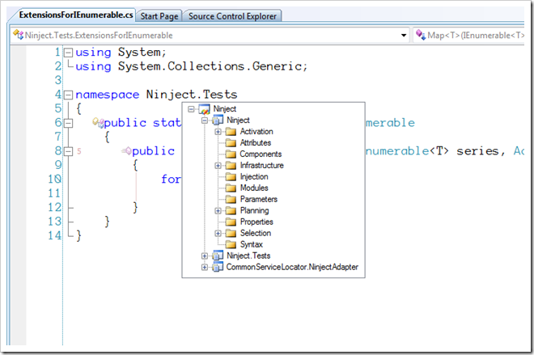

As of right about now, you should be able to mosey on over to the [DxCore Community Plug-ins page](http://code.google.com/p/dxcorecommunityplugins/), and grab a copy of [CR\_MoveFile](http://code.google.com/p/dxcorecommunityplugins/wiki/CR_MoveFile).  This is a plug-in I created primarily as a tool to aid in working in a TDD environment, but which certainly has uses for non-TDD applications.  It does basically what the name suggests, it allows you to move a file from one directory in your solution/project structure to another, even one in a different project.  I implemented this as a code provider (since it could change the functionality if you move the file from one project to another), so it will appear in the Code menu when you have the cursor somewhere within the beginning blocks of a file (“using” sections, namespace declaration, or class/interface/struct declarations).  Once selected you are presented with a popup window which has a tree that represents your current solution structure, with your current directory highlighted.  You can use the arrow keys to navigate the directories and choose a new home for your file.

If you move files between projects, the plug-in will create project references for you, so you don’t need to worry about that.  When the file is moved the file contents remain unchanged, so all namespaces will be the same as they were originally.  I did this mostly to keep the plug-in simple, but also because I could see situations where this would be good, and situations where this would be bad, and it seemed like this was a bad choice to make for people.  I’ve been using this plug-in on a day-to-day basis for a while now, and things seem pretty clean, I did run into a small issue, however, using it within a solution that was under source control.  At this point you need to make sure the project files effected by the move are checked out, otherwise the plug-in goes through the motions, but doesn’t actually do anything, which is quite annoying.  There is also no checking going on to make sure the language is the same between the source and target project, so if you work on a solution that contains C# **and** VB.Net projects, you have to be careful not to move files around to projects that can’t understand what they are (oh, and the project icons used on the tree view are all the same, so there is no visual indication of what project contains what type of files).

That’s pretty much it.  Clean, simple, basic.  Used with other existing CodeRush/Refactor tools like “Move Type To File” and “Move to Namespace”, this provides for some pretty powerful code re-organization.  Just make sure you run all of your tests :).
