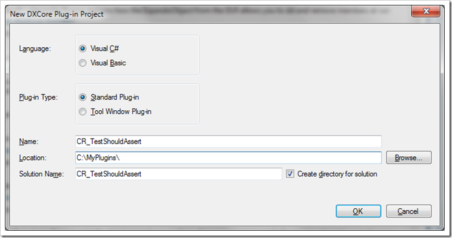

Anyone who has been around me for more than a few hours while coding, or who pays any attention to me on [Twitter](http://www.twitter.com/drrandom) will know that I am a huge fan of [CodeRush and Refactor Pro!](http://www.devexpress.com/Products/Visual_Studio_Add-in/Coding_Assistance/) from [DevExpress](http://www.devexpress.com).  I consider these sorts of tools essential to getting the most out of your development environment, and I think CodeRush is one of the best tools available for a number of reasons, not the least of which is it’s extensibility.  CodeRush is built on top of [DxCore](http://www.devexpress.com/Products/Visual_Studio_Add-in/DXCore/), which is a freely available library for building Visual Studio plug-ins (incidentally, DevExpress also have a free version of CodeRush called [CodeRush XPress](http://www.devexpress.com/Products/Visual_Studio_Add-in/CodeRushX/), which is built on the same platform).  DxCore provides any developer who wants it access to the same tools that the folks at DevExpress have for building plug-ins and extensions on top of VisualStudio, and several developers (including yours truly) have [done just that](http://code.google.com/p/dxcorecommunityplugins/).

One of the more recent additions to the CodeRush arsenal are the CodeIssues.  As of the v9 release, CodeRush included an extensive collection of these mini code analyzers which will look at your code in real time and do everything from let you know when you have undisposed resources, to suggesting alternate language features you may not even be aware of.  A lot of these are also tied in to the refactoring and code generation tools that already exist within CodeRush and Refactor Pro! so that not only do you see that there is an issue or suggestion, but in a lot of cases you can tell the tool to correct it for you.  Pretty impressive stuff.

So what I would like to do is dig in to how the CodeIssue functionality works within CodeRush by creating a custom CodeIssue Provider.  Because I’m a TDD guy, one of the things I’ve been trying to do is build in some tooling around the TDD process to make it that much easier to write code TDD.  So based on that I’m going to show you how to implement a CodeRush CodeIssueProvider which will generate a warning whenever you have created a Unit Test method with no assertions (which would indicate that you are either dealing with an Integration Test, or your test is not correctly factored).  **Note:** Since the CodeIssue UI elements are part of the full CodeRush product, and not CodeRush XPress, this plug-in will note do anything unless you are running the full version of CodeRush.

Okay, so the first thing to do is to create a new Plug-In project.  This can either be done from the Visual Studio File –> New Project menu, or by selecting the New Plug-in option from the DevExpress menu in visual studio (if you are using CodeRush XPress and you don’t have the DevExpress menu, my man Rory Becker has a solution for you).  Regardless of which way you go, you will get a “New DxCore Plug-in Project” window, which will ask you what Language you want to write your plug-in in (C# or Visual Basic .Net), and what kind of plug-in you want, along with the standard stuff about what to name the solution and where to store the files.  For our purposes we’re going to go with C# as the Language, a Standard Plug-in, and we’ll call it CR\_TestShouldAssert (the CR\_ is a naming convention used by the CodeRush team to indicate it’s a CodeRush plug-in, as opposed to a Refactoring or DxCore plug-in).



Net up is the “DxCore Plug-in Project Settings” dialog.  This allows you to give your plug-in a title, and set some more advanced options which deal with how the plug-in gets loaded by the DxCore framework.  We’ll just leave everything as-is and move on to the good stuff.

<!-- missing image: /image.axd?picture=transfer/WindowsLiveWriter/GettingaCodeRushInsideaCodeRushCodeIssue_D816/image_thumb_1.png -->

Once your project loads you will be presented with a design surface, this is because a large number of the components that are available via DXCore can actually be found in the Visual Studio toolbox, and you can just drag them out onto your plug-in designer to get started.  The CodeIssueProvider is an exception, though, so we will have to crack open the designer file to add it to our plug-in.  So open up the PlugIn1.designer.cs file, and add the following line of code under the “Windows Form Designer Generated Code” section:

```
CodeIssueProvider cipTestsShouldAssert;
```

You'll need to add a using statement for the DevExpress.CodeRush.Core namespace as well.  Next we need to instantiate it, so we need to do this in the the InitializeComponents method.  When you are finished your InitializeComponents method should look like this:

```
this.components = new System.ComponentModel.Container();
cipTestsShouldAssert = new CodeIssueProvider(this.components);
((System.ComponentModel.ISupportInitialize)(this)).BeginInit();
((System.ComponentModel.ISupportInitialize)(this)).EndInit();
```

Now if we switch back over to the designer, we will see our new provider on the design surface.  At this point we can use the Properties window to configure the provider.  The things we need to worry about filling out are the Description, DisplayName, and ProviderName properties.  The Description is the text that will be displayed in the Code Issue catalog, so it needs to clearly explain what the CodeIssueProvider is intended to do.  Let’s go with something like: “A Unit Test should have at least one explicit or implicit assertion.”  As for DisplayName, lets say something like “Unit Test Method Should Assert”, and make the ProviderName the same.

Ok, so now it’s time to actually do the work of finding a TestMethod that violates this condition.  So we need to switch over to the Events list for our provider, and Double-Click in the CheckCodeIssues drop-down so it generates an event handler for us.  You will now be taken to the code editor and presented with a empty handler that looks something like:

```
private void cipTestsShouldAssert_CheckCodeIssues(object sender, CheckCodeIssuesEventArgs ea)
{

}
```

This looks pretty much like your normal event handler, we’ve got the sender object (which would be our provider instance, and then we have a custom EventArgs object. Looking at this event args object, you can see quite a few methods, and a couple of properties.  The first few methods you see deal with actually adding your code issue, if it exists, to the list of issues reported by the UI.  You’ve got one method for each type of CodeIssue (AddDeadCode, AddError, AddHint, AddSmell,AddWarning), and then one method (AddIssue), which allows you to specify the CodeIssue Type.  Now this is where things start to get interesting because basically we’re at the point where the good folks who wrote DxCore have said “All right, go off and find your problem and report your finding back to me when your done”.  So from here we have to figure out whether or not there are any test methods without asserts floating around anywhere.  The good news is that there are a few tools in the CodeRush bag of tricks that can help us.

Perhaps the best tool for figuring out this sort of thing is the “Expression Lab” plug-in.  You can open this up by going to the DevExpress menu, opening the Tool Windows->Diagnostics->Expressions Lab.  This shows you in real time what the AST that CodeRush produces for your code looks like as you move about in a file.  You can also see all of the properties associated with the various syntax elements, and view how things are related.  This is a very handy tool to have.  Before we dig too deep into the Expressions Lab, lets get a start on finding our CodeIssue.  We know that we are going to be looking at methods here, since we are ultimately searching for test methods, so the first thing to do is to limit the scope of our search to just methods.  The CheckCodeIssues event is fired at a file level, so you are basically handed an entire file to search by the DxCore framework.  We need to filter that down a bit and only pay attention to the methods contained in the current file.  To do that we’re going to use the ResolveScope() method of the CheckCodeIssuesEventArgs object.  Calling the ResolveScope() method gives us a ScopreResolveResult object, which doesn’t sound very interesting, but this object has a wonderful little method on it called GetElementEnumerator().  This method will allow you to pass in a filter expression, and return all of the elements that match that filter expression as an enumerable collection. So to get to this, lets add the following to the body of our event handler:

```
var resolveScope = ea.ResolveScope();
foreach(IMethodElement method in resolveScope.GetElementEnumerator(ea.Scope,new ElementTypeFilter(LanguageElementType.Method)))
{
}
```

This looks pretty straightforward, but there are a couple of things I want to point out. First is the ea.Scope property that we are passing in to the GetElementEnumerable() method. This is the AST object that represents the top of the parse-tree that we are going to be searching for code issues in. Typically this is a file-level object, but I don't know that you can count on that always being the case (changing the parse settings could potentially effect how much of the code is considered invalid at a time, and so you could get larger or smaller segments of code).  The other interesting bit is the ElementTypeFilter().  This allows us to filter the list of AST elements given to us in our enumerable based on their LangueElementType (LanguageElement is the base class for syntax elements within the DxCore AST structure.  All nodes have an ElementType property which exposes a LanguageElementType enum value). In our case we’re only interested in methods, so we’re using LanguageElementType.Method.  The result is a collection of all of the methods within our Scope.

Now that we have all of our methods, we need to figure out if they are Test methods.  To do this we’ll have to look for the existence of an Attribute on the method.  Taking a look at Expressions Lab, we can see that a Method object has an Attributes collection associated with it. So we should be able to search the list of attributes for one with a Name property of “Test”.  Using Linq, we can do this pretty easily like this:

```
method.Attributes.OfType<IAttributeElement>().Count(a => a.Name == "Test")
```

This will give a a count of the "Test" attributes on our method. We can put this into an if statement like so:

```
if(method.Attributes.OfType<IAttributeElement>().Count(a => a.Name == "Test") > 0)
{
}
```

A quick note; I'm using the OfType<T>() method to convert the collection returned by the Attributes Property into an enumerable of IAttributeElements just as an easy way of enabling Linq expressions against the collection. Since DxCore is written to work with all versions of VisualStudio, there really isn't any official Linq support. As a matter of fact, using the expression we did limits the plug-in to only those people with .Net Framework 3.5 installed on their development machines. I think that in this day and age, this is a fairly safe assumption, so I'm not that worried about it. I would like to point out also, that having this expression in place does not prevent the plug-in from working with Visual Studio 2005, as long as the 3.5 framework is installed.

Ok, so now we have a list of methods, and we’re filtering them based on whether or not they are Test methods (defined by the existence of a Test attribute).  The next thing to do is look for an Assert statement within the text of our method.  This is another place where the Expressions Lab proves invaluable.  Looking at Expressions Lab we discover that our Assert statement is in fact an ElementReferenceExpression and is a child node of our Method object.  With this knowledge in hand we can use the FindElementByName method on our Method object to look for an Assert reference:

```
var assert = method.FindChildByName("Assert") as IElementReferenceExpression
```

Now all we have to do is test whether or not our assert variable is null, and we know whether or not this method violates our rule. Once we do that test we can add the appropriate Code Issue Type to the CodeIssues list using our event args. The last piece of the puzzle then will look something like this:

```
if(assert == null)
{
    ea.AddIssue(CodeIssueType.CodeSmell,(SourceRange)method.NameRanges[0],"A Test Method should have at least one Assert");
}
```

With this in place we should now be able to run our project and try it out. Using F5 to debug a DxCore plug-in will launch a new instance of Visual Studio. From there if you create a new project, or open an existing project, and write a test method which does not have an Assert, you should see a red squiggle underneath the name of the method. Hovering over that with your mouse you'll see our Code Issue test presented. Adding an Assert will make the Code Issue disappear.

<!-- missing image: /image.axd?picture=transfer/WindowsLiveWriter/GettingaCodeRushInsideaCodeRushCodeIssue_D816/image_thumb_2.png -->

Well, things are looking good here, we’ve got code that is searching for an issue, and displaying the appropriate warning if our condition is met.  There is one other condition we should probably consider, however.  The one case I can think of when our rule does not apply is when we are expecting the code under test to throw an exception.  In that case there would be an ExpectedException attribute on the test class.  To make our users happy we should probably implement this functionality.

The good news is we already know how to accomplish this, since we are using the same technique to determine if the method we’re looking at is a test method.  All we need to do is change the test condition in our Count() method so it looks for “ExpectedException” instead of “Test”.  While we’re at it it seems like a reasonable thing to get an instance of the attribute and then check it for null, similar to how we’re handling the assert.  With all of this done the code should look like this:

```
var assert = method.FindChildByName("Assert") as IElementReferenceExpression;
var expectedException = method.Attributes.OfType<IAttributeElement>().FirstOrDefault(a => a.Name == "ExpectedException");
if (assert == null && expectedException == null)
{
    ea.AddIssue(CodeIssueType.CodeSmell, (SourceRange)method.NameRanges[0], "A Test Method should have at least one implicit or explicit Assertion");
}
```

So now we should be able to run this, and see that the code issue disappears if we have a test method with either an assert statement, or an expected exception attribute. Pretty cool. You’ll notice that I also updated our issue message so it reflects the fact that we are able to handle implicit assertions (in the form of our ExpectedException) attribute.  For the sake of completeness, here is what our finished CheckCodeIssues method looks like:

```
private void cipTestShouldAssert_CheckCodeIssues(object sender, CheckCodeIssuesEventArgs ea)
{
    var resolveScope = ea.ResolveScope();
    foreach (IMethodElement method in resolveScope.GetElementEnumerator(ea.Scope, new ElementTypeFilter(LanguageElementType.Method)))
    {
        if (method.Attributes.OfType<IAttributeElement>().Count(a => a.Name == "Test") > 0)
        {
            var assert = method.FindChildByName("Assert") as IElementReferenceExpression;
            var expectedException = method.Attributes.OfType<IAttributeElement>().FirstOrDefault(a => a.Name == "ExpectedException");
            if (assert == null && expectedException == null)
            {
                ea.AddIssue(CodeIssueType.CodeSmell, (SourceRange)method.NameRanges[0], "A Test Method should have at least one implicit or explicit Assertion");
            }
        }
    }
}
```

And that's it. Granted there are some things here I would like to change before releasing this into the wild. We are specifically looking for NUnit/MbUnit style test method declarations for one, and we are also looking only for the short version of the attribute names, but this should give you a good idea of how things work.

If you are interested in seeing a more polished final version, you can either download the finished source for this post<!-- dead link: http://www.drrandom.org/downloads/CR_TestShouldAssert.zip -->, or have a look at my [CR\_CreateTestMethod](http://code.google.com/p/dxcorecommunityplugins/wiki/CR_CreateTestMethod) (admittedly poorly named) plug-in on the [DxCore Community Plug-In's site](http://code.google.com/p/dxcorecommunityplugins/).
