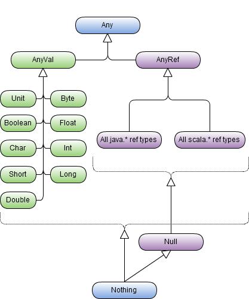

In Part 2 of this series we’re going to move into some of the object-oriented aspects of Scala.  For a primer on what Scala is, and a quick primer on syntax, check out [part 1](/2011/07/31/making-the-climb-chronicling-the-journey-from-c-to-scala/).

#### Let’s start with the built-in object structure

Like C# and Java, Scala has a built-in object hierarchy, and a standard library full of goodies.  Unlike Java and C#, Scala tackled the issue of reference types and value types head-on, so while the root type in the Scala type system is the `Any` type, there are two descendants of `Any` that come into play before any other type. The two are: `AnyRef`, and `AnyVal`. As you might guess `AnyRef` is the base type for all reference types (including types made available from Java), and `AnyVal` is the base type for all value types. This is a little bit like the `class` and `struct` type constraints in C#, only you can use these as variables. They can also be used to limit type parameters, but Scala Generics are going to have to get their own post.

There is one other interesting class that makes Scala unique from C# and Java (and maybe even other OO languages…I don’t think Ruby does this….pretty sure python doesn’t either….Smalltalk probably had it, but then Smalltalk had everything).  There is a class called `Nothing`, which is a _Subclass_ of **every** class. I'll give that a second to sink in.  Ok, got that? There is also another class called `Null` that is similar in that it is a _Subclass_ of every _reference_ type.  Here is a diagram of the Scala class hierarchy to make things a little clearer.

With this information fresh in our minds, lets take a look at actually putting together some Object-Oriented code.

#### The Trinity….Classes, Objects, and Traits

This was actually one of the first areas that made me go “Wow” in Scala land. Being on the JVM, you would expect it to use Java’s notion of classes and interfaces. But, interestingly, while it is built to support interoperability with Java directly, Scala starts asserting itself early on in the following way: In Scala you have three basic building blocks for OO, the Class, the Object, and the Trait. Taking these in order of most like what C# devs are used to up to the least, we’ll start with the **Class**. Classes in Scala are basically like C# classes…only with one significant difference: Scala classes do not have Statics. As a matter of fact there is no way to make a _Class_ static in Scala. That’s where **Object** comes in. _Object_ is basically a singleton, which you reference using _static-like_ syntax (so Name.Method). You can create something which looks like statics on classes by using a Companion Object, that is an Object which has the same name as the Class (and is in the same file). Objects have a couple special things going on like the ability to be used as Factories for other classes, and the special apply() and unapply() methods, which allow you to get instances of object, and come into play in nifty ways when we start talking about Pattern Matching. But before we get into that lets talk about the last of the Scala OO Trinity, the **Trait**. So Traits are really cool….they are effectively Interfaces, only they can contain implementation. I say _can_, but they don’t _have to_. So you can use Traits in a way that is similar to the way interfaces are used, or you can add implementation, and they become **Mixins**. What’s more, you can create a Trait that inherits from a Class, as well as a Class that extends a Trait. You can also create Objects that inherit from classes and extend Traits. You can also attach a Trait to an instance of a class at the time you instantiate the class, which means you can add behavior to a class declaratively at the time you need it. So lets get some code samples going here, just to give an idea of what this all looks like. Lets put together a totally non-realistic example of an Animal class hierarchy:

\[scala\]class Animal\[/scala\]

Ok, that was maybe no so helpful (but I will point out that this is valid, code...it compiles people, [try it out](http://simplyscala.org)). Lets move on to some categorization

\[scala\]class Feline extends Animal { var \_lives:Int = 9

def creep { } def scratch { } def hunt { } def livesLeft:Int = \_lives }

class Canine extends Animal { def howl { } def hunt { } def chaseFeline(cat:Feline) { } } \[/scala\]

So now we have a little more to work with...not much, but it's a start. Before we get too far, we have some duplication, so lets do a little refactoring...since both classes have a `hunt` method, we're going to pull this out into a Trait:

\[scala\]trait Hunting { def hunt { } } \[/scala\]

And to actually make use of this, our classes are now:

\[scala\]class Feline extends Animal with Hunting { var \_lives = 9

def creep { }

def scratch { } def livesLeft:Int = \_lives }

class Canine extends Animal with Hunting { def howl { } def chaseFeline(cat:Feline) { } } \[/scala\]

There, isn't that nice? The Trait is added to the class in this case with the addition of the `with` keyword (though if there was not a base class, we would need to use the `extends`. The rule is the first item is `extends`, and any other traits use `with`). We could also do this declaratively at instantiation time if we wanted. Like this:

\[scala\]val canine = new Canine() with Hunting\[/scala\]

Before we finish up (cause I think this is plenty to chew on for a while), I want to talk briefly about _visibility_ and _overrides_.  By default in Scala, everything is public…as a matter of fact there isn’t a `public` keyword at all. There are actually some really interesting options for scoping which give you more control than the `public,private,protected,internal,protected internal` options available in C#, but those will have to wait for a bit. As far as overrides, Scala does not have a `virtual` keyword. So everything is overridable (sort of). Unlike Java, if you want to override something you **have** to use the `override`keyword. Lets put together a quick example:

\[scala\]class Animal { def sleep { } }

class FruitBat extends Animal { override def sleep { if(isNighttime) super.sleep() } }\[/scala\]

Again, contrived, but so are most samples on blogs. Naturally we'll ignore the fact that `isNighttime` has no implementation, cause we can, and look at the fact that overriding existing functionality is pretty familiar to the C# dev, except for the call to `super` rather than `base`. The interesting thing to note here is that, by default, all methods can be overridden in Scala (using the `final` keyword on a method def will keep it from being overridden), and you must be explicit when you do it. This actually takes care of the complaints from folks, particularly when discussing testability, about C# requiring the `virtual` keyword to allow it to be overridden (and since everything is public by default, there is that argument too). It also takes care of complaints people have about the fact you can "accidentally" override methods in Java, since you don't have an `override`keyword (Some IDEs will look at an @Overrides annotation, but there is nothing checked at compile time for this).

We've covered quite a bit, and there are still some things we could talk about, but this takes care of the basics. You can now create Object Oriented code in Scala. In our next installment we'll dig in to the Scala concept of Generics, which actually makes C# generics look like a sad and feeble attempt at doing something interesting (while still dealing with [type erasure](http://en.wikipedia.org/wiki/Type_erasure) in the JVM).
